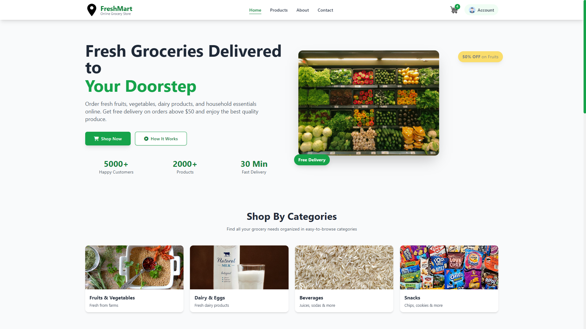
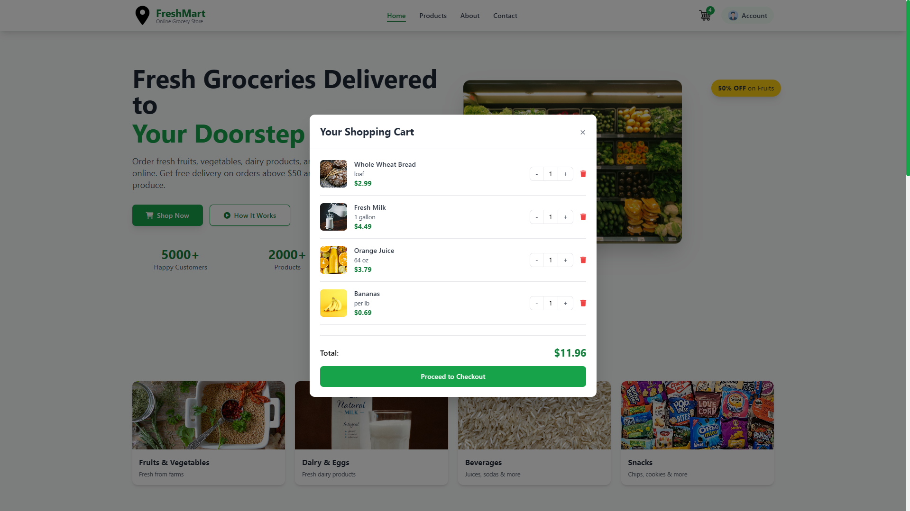

# 🛒 FreshMart — Online Grocery Store

**FreshMart** is a modern, responsive, and visually appealing online grocery store homepage. Designed with a fresh green aesthetic, this e-commerce template showcases grocery products, categories, and promotional content. Built with **Tailwind CSS** and vanilla JavaScript, it provides a solid foundation for any grocery delivery service.

## ✨ Features

### 🎯 Core Features
- **Fully Responsive Design** — Mobile, tablet, and desktop optimized
- **Sticky Navigation** — Header with logo, menu, cart, and user account
- **Mobile Hamburger Menu** — Smooth toggle for mobile devices
- **Hero Section** — Eye-catching headline, CTA buttons, stats, and animated floating badges
- **Category Grid** — 4 featured categories with hover animations
- **Featured Products Section** — Dynamic product cards (populated via JavaScript)
- **How It Works** — 3-step process with numbered circles
- **Newsletter Subscription** — Gradient background with email input
- **Shopping Cart Modal** — Interactive cart overlay with total calculation
- **Footer** — Company info, quick links, categories, contact, social media

### 🎨 UI/UX
- **Tailwind CSS** — Utility-first framework for rapid styling
- **Font Awesome 6** — Clean, scalable icons
- **Unsplash Imagery** — High-quality, professional food photography
- **Hover Animations** — Scale, translate, shadow transitions
- **Floating Badges** — Animated promotional badges (pulse, bounce-slow)
- **Cart Counter** — Dynamic item count with badge
- **Smooth Transitions** — 300ms duration on all interactive elements

### 📊 Stats Section
| Stat | Value | Description |
|------|-------|-------------|
| Happy Customers | 5000+ | Trusted by thousands |
| Products | 2000+ | Wide selection |
| Fast Delivery | 30 Min | Quick doorstep service |

### 📦 Categories
| Category | Image | Description |
|----------|-------|-------------|
| Fruits & Vegetables | Fresh produce | Fresh from farms |
| Dairy & Eggs | Milk, cheese, eggs | Fresh dairy products |
| Beverages | Juices, sodas | Refreshing drinks |
| Snacks | Chips, cookies | Quick bites |

## 🛠 Technologies Used

- **HTML5** — Semantic structure
- **Tailwind CSS** — Utility-first CSS framework (CDN)
- **JavaScript (ES6+)** — DOM manipulation, cart functionality
- **Font Awesome 6** — Icons for UI elements
- **Unsplash** — High-quality stock photography
- **Flaticon** — Brand logo and cart/user icons
- **Google Fonts** — System fonts (Inter, system-ui)

## 📁 Project Structure
